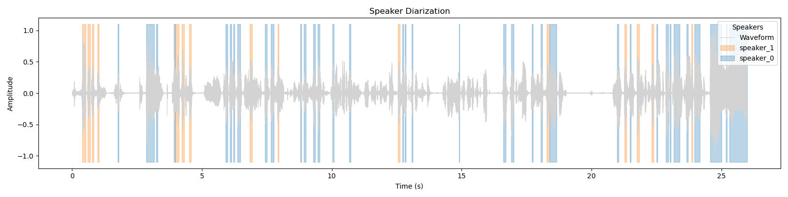

# Minimal Speaker Diarization Pipeline

This project implements a lightweight yet functional speaker diarization pipeline. It takes an audio file as input and outputs a JSON file listing "who spoke when".



## How the Pipeline Works

The pipeline processes audio in five sequential steps:

      [ Input WAV ]
            │
            ▼
    +----------------+
    | Audio Loading  |  (16kHz Mono)
    +----------------+
            │
            ▼
    +----------------+
    |      VAD       |  (Energy-based)
    +----------------+
            │
            ▼
    +----------------+
    |   Embedding    |  (ECAPA-TDNN ONNX)
    +----------------+
            │
            ▼
    +----------------+
    |   Clustering   |  (K-Means)
    +----------------+
            │
            ▼
    +----------------+
    | Label Assign.  |  (Merge Segments)
    +----------------+
            │
            ▼
     [ JSON Output ]

1.  **Audio Loading**: The input WAV file is loaded, converted to mono, and resampled to 16kHz (the native rate for the embedding model).
2.  **Voice Activity Detection (VAD)**: An energy-based VAD scans the audio to identify segments containing speech, discarding silence and low-energy noise.
3.  **Embedding Extraction**:
    -   Detected speech segments are sliced into sliding windows (1.5s duration).
    -   Log-Mel spectrograms are computed for each window.
    -   A **SpeechBrain ECAPA-TDNN** model (exported to ONNX) computes a dense vector representation (embedding) for each window.
    -   Embeddings are averaged to produce a single vector per speech segment.
4.  **Clustering**: **K-Means** clustering is applied to the segment embeddings to group them by speaker identity. The number of speakers must be specified.
5.  **Label Assignment**: Consecutive segments belonging to the same cluster are merged to produce the final diarization timeline.

## How to Run It Locally

### Prerequisites
Install the dependencies:

````bash
pip install -e .
````
### Exporting the Diarization Model to ONNX
The ONNX model we use is pushed to the repo, but you could re-export it locally by running:

````bash
python scripts/export_ecapa_model.py [--onnx-dir models] [--onnx-name embedding_model.onnx]
````

Note: this step does not exist when running the project with docker.

### Running the Diarization
Use the CLI script to process an audio file:

````bash
python scripts/diarize.py data/short_mulan.wav
[--model-path models/embedding_model.onnx]
[--num-speakers 2]
[--output data]
````

### Visualization
You can generate a plot of the waveform with colored speaker segments:


````bash
python scripts/visualize_diarization.py data/short_mulan.wav --output_dir data/outputs
````
---

## How to Run it with Docker 🐳

You can also run the diarization pipeline fully inside Docker.
The provided Dockerfile builds a minimal, production-minded environment containing:

Voici la version **parfaitement formatée en Markdown**, prête à être collée dans ton `README.md` :

## 🐳 Running with Docker

You can also run the diarization pipeline fully inside Docker.
The provided `Dockerfile` builds a minimal, production-minded environment containing:

* Python 3.9
* ONNX Runtime
* PyTorch 1.13.1 (CPU)
* Librosa, SoundFile, FFmpeg
* All project dependencies declared in `pyproject.toml`

This guarantees fully reproducible execution across environments.

---

### Build the Docker Image

From the project root:

```bash
docker build -t diarization .
```

This creates an image named **`diarization`**.

---

### Run the Diarization Inside Docker

The image ships with a default command:

```bash
python scripts/diarize.py data/short_mulan.wav
```

So you can simply run:

```bash
docker run --rm diarization
```

This will:

* load the ONNX embedding model
* run VAD → embeddings → clustering
* produce a diarization JSON in `data/outputs/` inside the container
* print the segments to stdout


### Visualizing the Diarization

Generate the waveform visualization (`.png`) inside Docker:

```bash
docker run --rm \
    -v $(pwd):/app \
    diarization \
    python scripts/visualize_diarization.py data/short_mulan.wav
```

The PNG will be written to:

```
data/short_mulan_viz.png
```

### Overriding the Default Docker Command

The `Dockerfile` ends with:

```dockerfile
CMD ["python", "scripts/diarize.py", "data/short_mulan.wav"]
```

You can override it by appending your own command (and thus test on your own data):

```bash
docker run --rm diarization python scripts/diarize.py data/other.wav
```


## Design Decisions & Trade-offs
*   **Library versions, dependency handling and CPU**:
    Pretty unhappy with this one, but my 2015 Intel Core MacBook gave me very little Leeway for developing this project locally, so I had to resort to using old versions of torch, numpy, and even python for retro-compatibility.
*   **ONNX Runtime for Inference**:
    I used ONNX Runtime instead of running the model directly in PyTorch/SpeechBrain. This reduces overhead and allows for faster CPU inference and easier deployment (namely to windows), but requires an explicit export step for the model.
*   **Energy-Based VAD**:
    I used a simple VAD based on signal energy thresholds. It is extremely fast and has zero external dependencies, but it is less robust to background noise compared to model-based VADs (like Silero). Additionally, the parameter tweaking process is quite tedious.
*   **K-Means Clustering**:
   I used a Standard K-Means from sklearn for grouping embeddings. It requires the user to know the number of speakers in advance (`--num-speakers`). It doesn't automatically detect the number of speakers like Spectral Clustering or Agglomerative Hierarchical Clustering would.

## Future Improvements

Given more time, the following improvements would be prioritized:

1. **Update & optimize dependencies**: I'd switch to using poetry for dependencies and would update everything to the latest versions of torch, numpy, etc.  I'm fairly sure I could extract or re-implement the few functions I use from librosa, which would allow me to remove it from the project's dependencies. Same thing for sklearn.
2. **GPU support**: Obviously GPU support is a must for this project, especially for the embedding extraction step. I'd add an option to select between CPU and GPU inference.
3. **Testing**: I'd write a few unit tests, at least for the most critical functions. If this was to be shipped to prod, I'd also run test coverage.
4. **VAD**: Replace the energy-based approach with a pre-trained neural VAD (e.g., Silero VAD or Pyannote's segmentation model) to handle noisy environments better. At the very least, I'd spend more time tweaking the parameters of the current version.
5. **Overlap Handling**: The current pipeline assumes one speaker at a time. Integrating an overlap-aware model would allow detecting multiple simultaneous speakers.

# Extra credits!

Voici une **section courte, claire et prête à coller** dans ton `README.md` pour expliquer comment lancer les tests et benchmarks de quantization.

---

## Quantization Tests & Benchmarking

This project includes optional “extra credit” scripts to evaluate model quantization and measure performance improvements (latency, CPU, memory).


```bash
python scripts/quantize.py \
    --model_path models/onnx/embedding_model.onnx \
    --output_path models/onnx/embedding_model_int8.onnx
```

This produces a smaller and faster INT8 version of the embedding model:

```
models/onnx/embedding_model_int8.onnx
```

### Run the performance benchmark

The benchmark measures:

* Average inference latency
* CPU utilization
* Memory usage

Run:

```bash
python scripts/bench.py
```

This prints a comparison table between:

* the baseline FP32 model
* the quantized INT8 model

Example output:

```
--- FP32 ---
Latency: 74.69 ms
CPU: 75.6%
Memory: 390.5 MB

--- INT8 ---
Latency: 34.43 ms
CPU: 76.3%
Memory: 298.3 MB
```

---

### Notes

* The benchmark shows that INT8 quantization significantly reduces model size and memory footprint, making the embedding model more lightweight for production environments. Latency improvements of 30–40% confirm that quantization boosts CPU inference speed without requiring hardware acceleration. Overall, the quantized model offers faster and cheaper inference while preserving the functional behavior needed for speaker diarization. Of course, rigourous testing would require output precision measures (as it is the downside of quantization compared to FP32 inference).
* The quantization reader uses synthetic fbank features for calibration.
* The INT8 model can drop into the diarization pipeline without code changes.
